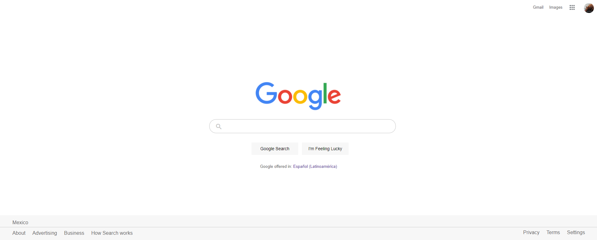

<h1>Google search menu (clon)</h1>

I created the google menu as an excercise to put in practice my knowledge in HTML and CSS. In this version I used positions to fix each element in its position.

## 🚀 Getting Started

You only need to open the .html file and you're set.

## 🎨 Preview

You can see the result here → [Google clon](https://themattfire.github.io/google-clon-v1/).

### 🖥 Desktop version

## 👩🏻‍💻 Technologies

1. HTML
2. CSS
